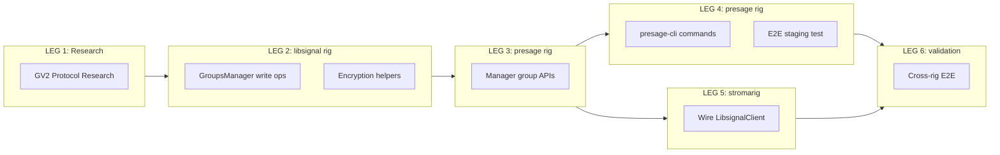

# GV2 Group CRUD Convoy

**Convoy**: To be assigned by Mayor
**Blocks**: hq-cv-xnrse (Stroma bootstrap flow requires create_group)
**Rigs**: libsignal, presage, stromarig

## Problem

Stroma's `BootstrapManager::complete_bootstrap()` calls `client.create_group(name)`. Neither presage nor libsignal-service-rs has group write operations. This is a Whisperfish ecosystem gap, not just a Stroma gap.

## Rig Assignment




## LEG 1: Research (any rig, parallelizable)

Research GV2 write protocol from reference implementations:

1. **[signal-cli](https://github.com/AsamK/signal-cli)** (Java) -- Closest reference, full GV2 CRUD
  - `lib/src/main/java/org/asamk/signal/manager/helper/GroupV2Helper.java`
  - Uses `GroupsV2Api` and `GroupsV2Operations` from libsignal-service-java
2. **[Signal-Desktop](https://github.com/signalapp/Signal-Desktop)** (TypeScript) -- REST API reference
  - `ts/groups.ts` -- `createGroupV2()`, `modifyGroupV2()`
  - `ts/textsecure/WebAPI.ts` -- HTTP endpoints (PUT `/v1/groups/`, PATCH `/v1/groups/`)
3. **[Signal-Android](https://github.com/signalapp/Signal-Android)** (Kotlin) -- Most complete
  - `app/src/main/java/org/thoughtcrime/securesms/groups/GroupManager.kt`
  - `app/src/main/java/org/thoughtcrime/securesms/groups/v2/GroupsV2Operations.java`
4. **[libsignal](https://github.com/signalapp/libsignal)** (Rust) -- zkgroup primitives
  - `rust/zkgroup/src/api/groups/` -- `GroupMasterKey`, `GroupSecretParams`

**Deliverable**: Research bead documenting the GV2 write protocol (create, add member, remove member) with exact API calls, proto structures, and encryption pipeline.

## LEG 2: libsignal-service-rs (libsignal rig)

**Branch**: `feature/gv2-group-crud` on `roder/libsignal-service-rs`
**Base**: `feature/protocol-v8-polls-rebased` (the libsignal-service-rs fork branch that presage depends on)

Add to `GroupsManager` in `src/groups_v2/manager.rs`:

```rust
pub async fn create_group(&mut self, group: proto::Group) -> Result<(), ServiceError>;
pub async fn modify_group(&mut self, master_key: &[u8], actions: proto::GroupChange_Actions) -> Result<proto::GroupChange, ServiceError>;
```

Add encryption helpers in `src/groups_v2/operations.rs`:

```rust
pub fn encrypt_group(params: &GroupSecretParams, title: &str, members: &[Member]) -> proto::Group;
pub fn build_add_member_action(params: &GroupSecretParams, aci: Aci, profile_key: ProfileKey, role: Role) -> proto::GroupChange_Actions;
pub fn build_remove_member_action(params: &GroupSecretParams, aci: Aci) -> proto::GroupChange_Actions;
```

**Upstream strategy**: PR to `roder/libsignal-service-rs`, then upstream to `whisperfish/libsignal-service-rs`.

## LEG 3: presage Manager APIs (presage rig)

**Branch**: `feature/gv2-group-crud` on `roder/presage`
**Base**: `integration/protocol-v8-polls` (UAT-validated: polls create/vote/terminate working E2E against live Signal, GroupContextV2 fix applied)
**Depends on**: LEG 2

**Note**: The `integration/protocol-v8-polls` branch on `roder/presage` merges work from three prior branches (`feature/protocol-v8-polls-compatibility`, `polecat/furiosa/pr-qxngt@mlerm1ur`, `polecat/nux/pr-qxngt@mlermrxg`) plus bug fixes (GroupContextV2 for polls, CLI consistency, docs). It has been tested end-to-end with real Signal servers. All new presage work should build on this branch.

Add to `Manager<S, Registered>` in `presage/src/manager/registered.rs`:

```rust
pub async fn create_group(&mut self, title: &str, members: Vec<(Aci, ProfileKey)>) -> Result<GroupMasterKeyBytes, Error<S::Error>>;
pub async fn add_group_member(&mut self, master_key: &[u8], aci: Aci, profile_key: ProfileKey) -> Result<(), Error<S::Error>>;
pub async fn remove_group_member(&mut self, master_key: &[u8], aci: Aci) -> Result<(), Error<S::Error>>;
pub async fn update_group_title(&mut self, master_key: &[u8], title: &str) -> Result<(), Error<S::Error>>;
```

Handles credential management, local store updates, `GroupContextV2` distribution.

**Upstream strategy**: PR to `roder/presage`, then upstream to `whisperfish/presage`.

## LEG 4: presage-cli commands + E2E (presage rig)

**Depends on**: LEG 3

```
presage-cli create-group --title "My Group" --member <UUID1> --member <UUID2>
presage-cli add-member -k <GROUP_KEY> --uuid <NEW_MEMBER_UUID>
presage-cli remove-member -k <GROUP_KEY> --uuid <MEMBER_UUID>
```

Test against Signal staging servers. Verify group appears on mobile Signal app with correct members.

## LEG 5: Wire into Stroma (stromarig)

**Depends on**: LEG 3

Replace `NotImplemented` stubs in `src/signal/client.rs` for:

- `create_group` -- calls `manager.create_group()`
- `add_group_member` -- calls `manager.add_group_member()`
- `remove_group_member` -- calls `manager.remove_group_member()`

This unblocks `BootstrapManager::complete_bootstrap()` and `GroupManager::add_member()` / `remove_member()`.

## LEG 6: Cross-rig E2E validation

**Depends on**: LEG 4 + LEG 5

Full flow: register bot -> create group -> add seed members -> send poll -> vote -> terminate. Validates the complete chain across all three rigs.

## GV2 Protocol Summary

**Create**: Generate `GroupMasterKey` (32 random bytes) -> derive `GroupSecretParams` -> encrypt title + members -> PUT `/v1/groups/` -> distribute `GroupContextV2`

**Add member**: Build `GroupChange::Actions` with `AddMemberAction` (encrypted ACI + profile key) -> PATCH `/v1/groups/` -> update local cache

**Remove member**: Build `GroupChange::Actions` with `DeleteMemberAction` -> PATCH `/v1/groups/` -> update local cache

## Current State of Presage Fork

The `roder/presage` fork on branch `integration/protocol-v8-polls` includes:

- Protocol v8 poll support (PollCreate, PollVote, PollTerminate)
- GroupContextV2 fix for all poll message types (was missing, caused messages to arrive as DMs instead of group messages)
- CLI consistency fixes (`--poll-author-uuid`, `-o` append mode, `--master-key` in all docs)
- Tested E2E: create poll, vote, terminate, receive -- all functional against live Signal production servers

**What it does NOT have** (this convoy addresses):

- Group creation (`Manager::create_group`)
- Group member management (`Manager::add_group_member`, `Manager::remove_group_member`)
- Any CLI commands for group CRUD

## Upstream PR Requirements

Both libsignal-service-rs and presage PRs must include:

- Documentation comments matching existing Whisperfish style
- Integration tests (marked `#[ignore]`)
- CLI commands for manual E2E testing
- No Stroma-specific code (upstream-clean)

