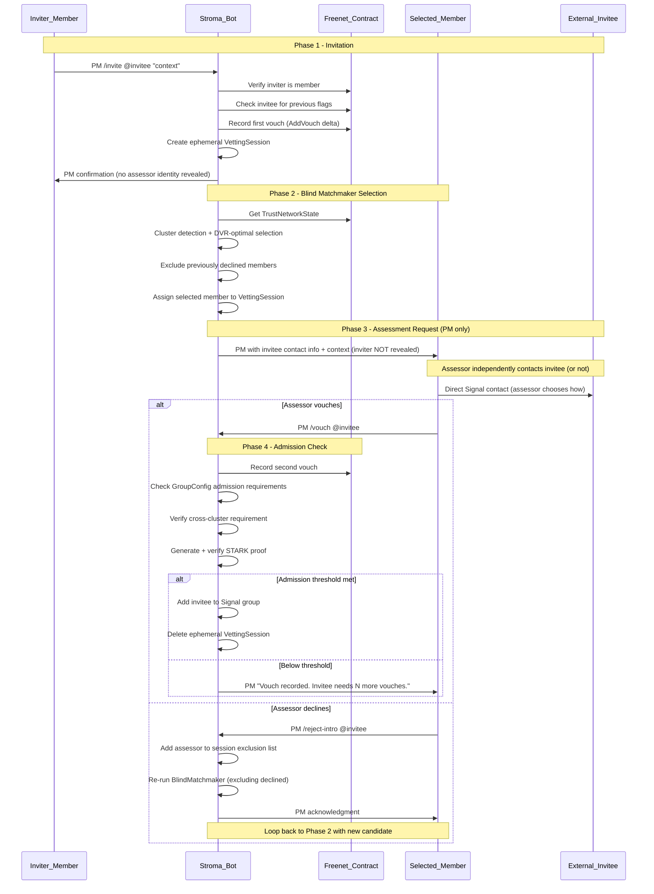

# Privacy-First Admission Vetting Flow

## Design Constraints

- **Bot belongs to exactly one Signal group** (per `bot-deployment-model.bead`). No 3-person chats, no secondary groups. All bot communication is 1-on-1 PMs or messages in the single maintained group.
- **Selected member contacts invitee independently of the bot.** The bot provides the invitee's Signal contact info to the selected member via PM. The member decides whether to reach out, how to identify themselves, and whether to expose their membership. This preserves member agency.
- **No `/introduce` command.** The introduction is bot-initiated after `/invite`. The only new command is `/reject-intro @invitee` for a selected member to decline the assessment.

## Current State

The codebase has the skeleton but most of the admission flow is TODOs:

- `[src/signal/matchmaker.rs](src/signal/matchmaker.rs)`: `BlindMatchmaker::select_validator()` exists but uses a Phase 0 approximation (voucher-set exclusion instead of real cluster detection)
- `[src/signal/vetting.rs](src/signal/vetting.rs)`: `VettingSessionManager` is well-structured with the right lifecycle (`PendingMatch` -> `AwaitingVouch` -> `Admitted`/`Rejected`)
- `[src/signal/bot.rs](src/signal/bot.rs)`: `handle_invite()` creates a session and calls `select_validator()`, but lines 190-192 are all TODOs for the actual notification flow
- `[src/matchmaker/strategic_intro.rs](src/matchmaker/strategic_intro.rs)`: This module is for **mesh-building among existing members only** (post-admission optimization), NOT for the admission vetting flow. It remains separate and unchanged.

## Two Distinct Blind Matchmaker Roles

These must remain architecturally separate:

1. **Admission Vetting** (`signal/matchmaker.rs`): Selects a cross-cluster member (validator or bridge) to assess an invitee. Drives the `/invite` flow.
2. **Mesh Optimization** (`matchmaker/strategic_intro.rs`): Suggests introductions between existing members to improve DVR. Drives `/mesh` health suggestions. No changes needed here.

## Complete Admission Flow Design




## Privacy Guarantees

- **Invitee learns only what the assessor chooses to reveal.** The bot never contacts the invitee directly. The selected member decides whether to identify themselves as a group member, use a pseudonym, or approach through a mutual context. The bot gives no information to the invitee.
- **Assessor does NOT learn who invited.** The bot says "someone has invited [invitee]" -- the inviter's identity is hidden ("Blind" in Blind Matchmaker). This prevents social pressure and collusion.
- **Inviter does NOT learn which member was selected.** The bot says "reaching out to a cross-cluster member" -- no name revealed. This prevents the inviter from coaching the invitee about who will contact them.
- **Group does NOT learn invitee identity until admission.** Announcement uses member hash, not Signal ID or username.
- **All vetting data is ephemeral.** `VettingSession` is RAM-only, deleted after admission/rejection.
- **No Signal IDs in cleartext.** All identities HMAC-hashed immediately with ACI-derived key, then zeroized.
- **Bot stays in its one group.** No secondary chats, no 3-person groups. All bot interaction is 1-on-1 PMs with members.

## Code Changes Required

### 1. Enhance `BlindMatchmaker` (`[src/signal/matchmaker.rs](src/signal/matchmaker.rs)`)

Replace Phase 0 approximation with real cluster detection:

- Import and use `matchmaker::graph_analysis::TrustGraph` + `detect_clusters`
- Accept an exclusion list parameter: `excluded: &HashSet<MemberHash>` (members who declined via `/reject-intro`)
- Selection priority (DVR-optimized):
  - Phase 0: Cross-cluster member whose voucher sets don't overlap with existing distinct validators (DVR-optimal)
  - Phase 1: Any cross-cluster member (MST fallback)
  - Phase 2: Any member from a different cluster (bridge-level)
  - Bootstrap exception: Any member when only 1 cluster exists
- Candidates can be validators (3+ vouches) OR bridges (2 vouches) -- both are eligible assessors
- Sort candidates by centrality (prefer well-connected members)
- Return `Option<MemberHash>` (None = no eligible candidates remain)

### 2. Implement notification flow in `StromaBot::handle_invite()` (`[src/signal/bot.rs](src/signal/bot.rs)`)

Fill in the TODO Phase 1 items at lines 156-212:

- Query Freenet to verify sender is a member
- Query Freenet for previous flags on the invitee
- After `select_validator()`: resolve selected `MemberHash` -> `ServiceId` via `MemberResolver`
- Call `vetting_sessions.assign_validator()`
- Send PM to selected member with: invitee Signal contact info, inviter-provided context, previous-flags warning if applicable
- PM explicitly states: "Please reach out to them directly to assess. Use `/vouch @invitee` to confirm, or `/reject-intro @invitee` to decline."
- Update session status to `AwaitingVouch`
- Send confirmation PM to inviter (no assessor identity revealed)

### 3. Add `/reject-intro` command (`[src/signal/pm.rs](src/signal/pm.rs)`, `[src/signal/bot.rs](src/signal/bot.rs)`)

New command in the PM interface:

```rust
// In pm.rs Command enum:
RejectIntro { username: String },

// Parsing:
"/reject-intro" => RejectIntro { username: parts[1] }
```

Handler in `StromaBot`:

- Verify sender is the currently assigned assessor for this invitee's VettingSession
- Add sender's `MemberHash` to `session.excluded_candidates`
- Reset session status to `PendingMatch`
- Re-run `BlindMatchmaker::select_validator()` with the updated exclusion list
- If a new candidate is found: PM them with assessment request, update session
- If no candidates remain: notify inviter that no assessor is available; session enters a stalled state
- Send acknowledgment PM to the declining member

### 4. Enhance `StromaBot::handle_vouch()` (`[src/signal/bot.rs](src/signal/bot.rs)`)

Complete the TODO Phase 1 items at lines 219-225:

- Hash sender's ServiceId to MemberHash
- Look up active VettingSession for the vouched username
- Verify the voucher is cross-cluster relative to the inviter (using real cluster detection)
- Record vouch in Freenet (AddVouch delta)
- **Check ALL GroupConfig admission requirements** -- not a hardcoded threshold:
  - `effective_vouches >= config.min_vouch_threshold` (default 2, configurable via `/propose`)
  - Cross-cluster requirement met (or single-cluster exception applies)
  - Standing is non-negative
- If ALL conditions met: generate STARK proof via `verify_admission_proof()`, add invitee to Signal group, announce admission (hash only), delete ephemeral session, notify inviter
- If vouch recorded but threshold NOT yet met: notify assessor that vouch is recorded, invitee still needs N more vouches. Session stays active (status remains `AwaitingVouch` or transitions to `PendingMatch` for additional assessors if needed)

### 5. Add vetting notification messages (`[src/signal/vetting.rs](src/signal/vetting.rs)`)

Privacy-safe PM message templates:

- **To assessor** (assessment request):
  > "Someone has invited @[invitee] to the group.
  > Context: [inviter-provided context]
  >
  > Please reach out to them directly to assess whether they should join. You decide how to contact them and what to share about yourself.
  >
  > When ready: `/vouch @[invitee]` to confirm, or `/reject-intro @[invitee]` to pass."
  > If invitee has previous flags, append: "Note: This person has [N] previous flags from a past membership."
  > Does NOT reveal who invited. Does NOT instruct assessor to identify themselves as a member.
- **To inviter** (confirmation):
  > "Your invitation for @[invitee] has been recorded as a first vouch. I'm reaching out to a member from a different part of the network for assessment. You'll be notified when the process completes."
  > Does NOT reveal which member was selected.
- **To assessor** (rejection acknowledged):
  > "Noted. Another member will be asked to assess @[invitee]."
- **To assessor** (vouch recorded, below threshold):
  > "Vouch for @[invitee] recorded. They still need [N] more vouch(es) to meet the admission threshold."
- **To inviter** (no candidates):
  > "Unable to find an available cross-cluster member to assess @[invitee]. The invitation remains pending."
- **To inviter** (admission):
  > "@[invitee] has been admitted to the group."

### 6. Extend `VettingSession` (`[src/signal/vetting.rs](src/signal/vetting.rs)`)

Add fields to track re-selection:

```rust
pub struct VettingSession {
    // ... existing fields ...

    /// Members who declined assessment via /reject-intro (excluded from re-selection)
    pub excluded_candidates: HashSet<MemberHash>,
}
```

Add `Declined` state to inform the re-selection loop:

```rust
pub enum VettingStatus {
    PendingMatch,
    AwaitingVouch,
    Admitted,
    Rejected,
    Stalled,  // No eligible candidates remain
}
```

Note: `Declined` is not a terminal state -- it transitions back to `PendingMatch` for re-selection. `Stalled` is when all eligible candidates have been exhausted.

### 7. ServiceId resolution -- MemberResolver (`[src/signal/](src/signal/)`)

Per `blind-matchmaker-dvr.bead`: Bot maintains a transient in-memory mapping of `MemberHash` <-> `ServiceId`:

- Rebuilt on bot startup from the Signal group member roster
- NEVER persisted to disk
- Uses HMAC with bot's ACI-derived key for the hash direction
- Needed to resolve `select_validator()` result (a `MemberHash`) back to a `ServiceId` for sending PMs
- Updated when members are added/removed from the group

New `MemberResolver` struct in `src/signal/member_resolver.rs`.

## Security Constraints (Must Verify)

- No cleartext Signal IDs stored or logged at any point
- VettingSession ephemeral (RAM only, deleted after admission/rejection)
- Bot never creates secondary Signal groups or chats -- only PMs and the one maintained group
- Validator selection uses real cluster detection (not Phase 0 approximation)
- Cross-cluster requirement enforced (with bootstrap single-cluster exception)
- STARK proof generated and verified before admission
- No grace periods in any part of the flow
- Inviter identity never revealed to assessor
- Assessor identity never revealed to inviter

### 8. Update terminology: "Assessor" throughout beads and docs

The member selected by the Blind Matchmaker to vet an invitee should be canonically called **assessor**. This term must be added/updated in:

- **Beads**: `terminology.bead` (add Assessor definition), `vetting-protocols.bead` (Phase 3 uses "selected member"), `blind-matchmaker-dvr.bead`, `signal-integration.bead` (bot roles), `user-roles-ux.bead` (role table)
- **Docs**: `HOW-IT-WORKS.md` (admission walkthrough), `USER-GUIDE.md` (command reference, roles), `TRUST-MODEL.md` (role definitions), `ALGORITHMS.md` (matchmaker description)
- **Cursor rules**: `vetting-protocols.mdc`, `signal-integration.mdc`, `user-roles-ux.mdc`, `terminology.mdc`

The definition: "Assessor -- A member (bridge or validator) selected by the Blind Matchmaker from a different cluster to independently contact and evaluate an invitee for admission. The assessor decides how to approach the invitee and whether to vouch."

### 9. Add `/reject-intro` command to beads and docs

The new `/reject-intro @invitee` command must be documented in:

- **Beads**: `signal-integration.bead` (command list), `user-roles-ux.bead` (command reference table), `vetting-protocols.bead` (admission flow Phase 3)
- **Docs**: `USER-GUIDE.md` (bot commands section), `HOW-IT-WORKS.md` (admission walkthrough)
- **Cursor rules**: `user-roles-ux.mdc` (key commands list), `signal-integration.mdc`

Command description: "Decline an assessment request. The bot will select another cross-cluster member to assess the invitee. Only usable by the member who received the assessment request."

## Out of Scope

- `**matchmaker/strategic_intro.rs**`: No changes. This is for mesh-building among existing members, a separate post-admission concern.
- **Federation / Diplomat**: External cross-mesh vouching is a separate system.
- `**/introduce` command**: Does not exist and should not be created. Introduction is bot-initiated after `/invite`.
- **Bot-to-invitee communication**: The bot never messages the invitee. The selected member contacts them independently.

