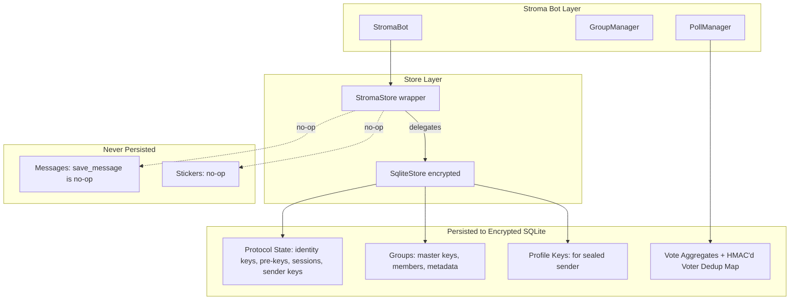
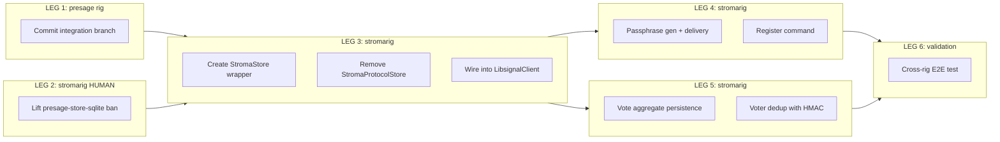

# StromaStore Wrapper Migration Convoy

**Convoy**: To be assigned by Mayor
**Blocks**: hq-cv-xnrse (Stroma UAT requires persistent store for Signal protocol state)
**Rigs**: presage, stromarig
**Presage base branch**: `integration/protocol-v8-polls` on `roder/presage` (UAT-validated: polls E2E working against live Signal)

## Problem

Stroma's `StromaProtocolStore` is completely unimplemented (`load`/`save` return `NotImplemented`). It doesn't implement presage's `Store` trait. Signal account configuration, group membership, and vote state cannot survive process restarts.

## Architecture Decision

Wrap presage's existing `SqliteStore` (with SQLCipher encryption) in a `StromaStore` newtype that:

- Delegates all persistence EXCEPT message storage (no-op)
- Never writes individual messages to disk (seizure protection)
- Persists protocol state, groups, profiles, vote aggregates
- Uses 24-word BIP-39 passphrase for SQLCipher encryption




## Threat Model

The SQLCipher passphrase is the root security boundary. It protects the ACI private key, which is the master key for both Signal identity and Freenet chunk encryption. The voter dedup map (HMAC'd hashes in the same encrypted DB) adds zero incremental attack surface beyond the ACI key.

Voter dedup data is zeroized immediately on poll outcome determination. Current proposal types (config changes) are low-value; federation proposals (higher value) are deferred.

## Convoy Legs




## LEG 1: Commit presage integration branch (presage rig)

**Branch**: `integration/protocol-v8-polls` on `roder/presage`

Commit and push all pending changes from the current session:

- GroupContextV2 fix for poll/vote/terminate (was missing, caused group messages to arrive as DMs)
- CLI consistency: `--poll-author-uuid` (was `--poll-author`), `-o` append mode (was comma-delimited), `--master-key` in all docs
- Documentation updates across POLL_QUICKSTART.md, POLL_TESTING.md, TESTING_POLLS.md, test_polls.sh

This branch is UAT-validated against live Signal production servers.

## LEG 2: Lift presage-store-sqlite ban (stromarig, REQUIRES HUMAN APPROVAL)

CI/CD infrastructure changes per AGENTS.md rules:

- `**deny.toml**` (line ~111-116): Remove `presage-store-sqlite` ban, add comment explaining StromaStore wrapper
- `**.github/workflows/security.yml**` (lines 74-79, 183-205): Update to verify `StromaStore` instead of `StromaProtocolStore`
- `**Cargo.toml**` (line 24): Add `presage-store-sqlite` dependency, remove `# DO NOT USE` comment

## LEG 3: Create StromaStore and remove StromaProtocolStore (stromarig)

**Depends on**: LEG 1 (presage branch pushed), LEG 2 (ban lifted)

**Create** `src/signal/stroma_store.rs` (~200-300 lines):

- `pub struct StromaStore(SqliteStore)` newtype wrapper
- Implement `Store`, `StateStore`, `ContentsStore` by delegation
- No-op: `save_message` -> `Ok(())`, `message` -> `Ok(None)`, `messages` -> empty iter, sticker methods similarly
- Delegate: groups, contacts, profiles, protocol state -> SqliteStore
- Constructor: `StromaStore::open(path, passphrase)`

**Remove** `src/signal/store.rs` (StromaProtocolStore):

- Delete file
- Update `src/signal/mod.rs`: swap `pub use store::StromaProtocolStore` for `pub use stroma_store::StromaStore`
- Update `src/signal/client.rs`: replace `_store: StromaProtocolStore` with presage `Manager<StromaStore, Registered>`
- Update `src/signal/linking.rs`, `src/cli/link_device.rs`, `src/cli/backup_store.rs`

## LEG 4: Passphrase generation and CLI key management (stromarig)

**Depends on**: LEG 3

**Passphrase generation**: 24-word BIP-39 recovery phrase (256 bits entropy), displayed once on stderr at link/register time. SQLCipher has no passphrase length limit (PBKDF2-HMAC-SHA512, 256K iterations).

**Delivery modes** (checked in order):

1. `--passphrase-file /path/to/key` (container-native: Docker secrets, K8s volumes)
2. Stdin prompt (interactive, masked input)
3. `STROMA_DB_PASSPHRASE` env var (fallback, warned as insecure)

**CLI updates** in `src/cli/mod.rs`:

- Add `--passphrase-file` to `LinkDevice`, `Run`, `BackupStore`
- New `Register` command (new file `src/cli/register.rs`) mirroring presage-cli register with passphrase integration
- Shared helpers: `read_passphrase()`, `resolve_store_path()`

**Register flow**:

```
stroma register --phone-number "+1234567890" --servers staging [--captcha URL] [--passphrase-file /path]
```

1. Generate or read passphrase
2. Open/create StromaStore with encryption
3. `Manager::register(store, RegistrationOptions { ... })`
4. Prompt for SMS confirmation code
5. Print ACI/PNI, display recovery phrase on stderr

## LEG 5: Vote aggregate persistence and voter deduplication (stromarig)

**Depends on**: LEG 3

Update `src/signal/polls.rs`:

**Voter dedup map** (persisted as HMAC'd hashes in encrypted SQLite):

- `voter_selections: HashMap<u64, HashMap<String, Vec<u32>>>` -- `poll_id -> (HMAC(voter_ACI, pepper) -> selected_options)`
- On `process_vote`: look up previous vote, decrement old options, increment new ones. Handles vote changes correctly.
- `Drop` impl zeroizes the map

**Persistence**:

- `persist_poll_state` / `restore_poll_state` methods
- Serialize `active_polls` + `vote_aggregates` + `voter_selections` (CBOR or JSON) to encrypted store KV
- **Zeroize on outcome**: delete dedup map for poll from memory and store immediately when `check_poll_outcome` returns a result
- On restart: both aggregates and dedup map restored. No double-counting.

**Threat model**: Voter dedup map contains `HMAC(ACI, pepper) -> [option_indices]`. Same attack chain as extracting ACI private key (which compromises entire Freenet trust map). Zero incremental risk. Data exists only for poll lifetime, zeroized on outcome.

## ~~LEG 6: Update documentation and beads~~ -- COMPLETED

Documentation and bead updates have been completed ahead of convoy execution:

- **Beads**: security-constraints, technology-stack, signal-integration, voting-mechanism + 6 additional beads + 2 formula files
- **Docs**: SIGNAL-STORAGE-SECURITY.md (full rewrite), SECURITY-CI-CD.md, DEVELOPER-GUIDE.md, THREAT-MODEL.md, THREAT-MODEL-AUDIT.md, OPERATOR-GUIDE.md, TODO.md

**Mayor action required**: Update bead task `st-uk6d8` (Implement StromaProtocolStore persistence) -- this task is superseded by the StromaStore wrapper convoy. The task should be closed and replaced with new tasks aligned to convoy LEGs 3-5.

## LEG 6: Cross-rig E2E validation (stromarig + presage rig)

**Depends on**: LEG 4 + LEG 5

Full validation flow:

1. `stroma register` (or `link-device`) -- generates passphrase, creates encrypted store
2. `stroma run` -- bot starts with passphrase from file
3. Send poll via presage-cli -> verify received in Stroma group
4. Vote on poll -> verify aggregate counts correct
5. Change vote -> verify dedup handles it (no double-count)
6. Kill and restart bot process -> verify store, groups, vote state all survive
7. Poll terminates -> verify dedup map zeroized from store

## Dependency on Presage Base

All work depends on `integration/protocol-v8-polls` branch of `roder/presage`. This branch:

- Merges 3 prior feature branches (protocol-v8 polls, furiosa E2E, nux E2E validation)
- Includes GroupContextV2 fix (critical: without it, group messages arrive as DMs)
- Includes CLI consistency fixes
- UAT-validated against live Signal production servers
- Is the correct `presage-store-sqlite` source for Stroma's `Cargo.toml` dependency

